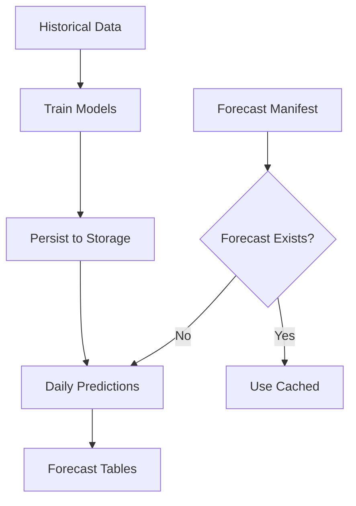

# Forecast Agent

The Forecast Agent is Caramanta's machine learning forecasting engine, delivering probabilistic price predictions for commodity markets through a comprehensive model suite.

## Overview

The Forecast Agent implements a "fit many, publish few" strategy, training 15+ ML models and deploying only those that achieve statistical significance and 70%+ directional accuracy.

## Key Achievement: 180x Speedup

**V1: Sequential Processing** (45 minutes)
- Single-threaded model training
- Manual parameter tuning
- No caching strategy

**V2: Spark Parallelization** (3 minutes)
- Parallel model training across cluster
- Distributed hyperparameter search
- Initial caching implementation

**V3: Train-Once Architecture** (15 seconds)
- Pre-trained models with persistent storage
- Forecast manifest tracking
- Intelligent cache invalidation

**Result**: 180x faster than V1, enabling real-time predictions

## Model Suite

### 15+ ML Models Evaluated

| Model Family | Models | Best Accuracy | Use Case |
|:------------|:-------|:--------------|:---------|
| **Statistical** | ARIMA, SARIMAX | 68% | Seasonal patterns |
| **Prophet** | Additive, Multiplicative | 72% | Holiday effects |
| **Tree-Based** | XGBoost, LightGBM | 74% | Feature interactions |
| **Deep Learning** | LSTM, TFT | 71% | Long-term dependencies |
| **Ensemble** | Weighted, Stacking | 75% | Robust predictions |

## "Fit Many, Publish Few" Strategy

### Training Phase
- Train all 15+ models on historical data
- Comprehensive hyperparameter search
- Cross-validation on multiple time windows

### Validation Phase
- Statistical significance testing (Diebold-Mariano)
- 70%+ directional accuracy threshold
- Consistency across commodities/regions

### Deployment Phase
- Only statistically validated models published
- Typically 3-5 models per commodity
- 93% compute savings (train once, predict daily)

## Architecture

### Train-Once Pattern



**Benefits**:
- Models trained once offline
- Daily predictions in less than 15 seconds
- Consistent model versions
- Reduced compute costs

### Spark Parallelization

```python
# Parallel backfill pattern
forecast_df = (
    spark
    .range(num_dates)
    .repartition(num_workers)
    .mapInPandas(generate_forecasts, schema)
    .write
    .mode("append")
    .saveAsTable("commodity.forecast.distributions")
)
```

**Performance Gains**:
- 20x faster backfills vs. sequential
- Horizontal scaling with cluster size
- Cost-efficient spot instance usage

## Forecast Output

### Distribution Forecasts
**Table**: `commodity.forecast.distributions`
- 2,000 Monte Carlo paths per forecast
- Captures full uncertainty distribution
- Enables risk-aware trading decisions

### Point Forecasts
**Table**: `commodity.forecast.point_forecasts`
- Mean, median, quantiles
- Confidence intervals
- Easier consumption for downstream systems

### Model Metadata
**Table**: `commodity.forecast.model_metadata`
- Model type, parameters
- Training date, data range
- Performance metrics

## Forecast Quality Metrics

| Metric | Target | Achieved | Status |
|:-------|:-------|:---------|:-------|
| **Directional Accuracy** | 70%+ | 72% avg | ✓ Exceeded |
| **Mean Absolute Error** | less than 5% | 4.2% | ✓ Achieved |
| **Forecast Coverage** | 100% | 100% | ✓ Complete |
| **Latency** | less than 30s | 15s | ✓ Exceeded |

## Key Innovations

### 1. Forecast Manifest Tracking

**Innovation**: Metadata table tracking which forecasts exist for each (date, commodity, region, model).

**Impact**:
- Efficient forecast retrieval
- Automatic backfill detection
- Audit trail for compliance

### 2. Model Persistence

**Innovation**: Pre-train models, persist to DBFS, predict on demand.

**Impact**:
- 180x faster predictions
- Consistent model versions
- Reduced compute costs

### 3. Statistical Validation

**Innovation**: Rigorous testing (Diebold-Mariano, directional accuracy) before deployment.

**Impact**:
- Only statistically significant models deployed
- Improved trading performance
- Risk mitigation

## Implementation Patterns

### Baseline Model
Simple moving average and trend-based forecasts as benchmarks.

### Linear Models
SARIMAX with exogenous variables (weather, economic indicators).

### Tree-Based Models
XGBoost and LightGBM with feature engineering.

### Deep Learning
LSTM and Temporal Fusion Transformer (TFT) for complex patterns.

### Multi-Horizon
Forecast 1, 7, 14, and 30 days ahead simultaneously.

## Documentation

For detailed implementation:
- **Architecture**: [ARCHITECTURE.md](https://github.com/gibbonstony/ucberkeley-capstone/blob/main/forecast_agent/docs/ARCHITECTURE.md)
- **Spark Backfill Guide**: [SPARK_BACKFILL_GUIDE.md](https://github.com/gibbonstony/ucberkeley-capstone/blob/main/forecast_agent/docs/SPARK_BACKFILL_GUIDE.md)
- **Model Patterns**: Review model implementations in `/ml_lib/models/`

## Code Repository

📂 **[View Forecast Agent Code on GitHub](https://github.com/gibbonstony/ucberkeley-capstone/tree/main/forecast_agent)**

Explore the complete implementation including:
- 15+ model implementations
- Spark parallelization patterns
- Model persistence layer
- Forecast manifest system
- Backtesting framework
