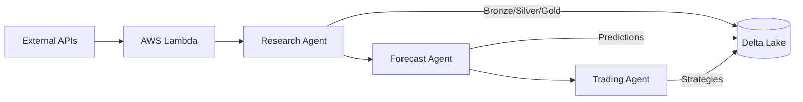

# Overview

Caramanta is an end-to-end AI-powered trading agent designed to forecast commodity prices and optimize trading strategies for coffee, cocoa, and sugar markets.

## Mission

Deliver actionable trading recommendations through a three-agent architecture that combines advanced machine learning, rigorous optimization, and real-time data processing.

## Key Achievements

### 90% Data Reduction
From 75,000 raw data points to 7,600 unified daily records while maintaining complete market coverage through forward-fill interpolation.

### 180x Speedup
Evolution from V1 → V2 → V3 architecture achieved dramatic performance improvements through Spark parallelization and optimized data structures.

### 70% Accuracy Threshold
Rigorous statistical testing identified models achieving 70%+ directional accuracy, filtering from 15+ candidate models to high-confidence predictions.

### 93% Compute Savings
"Fit many, publish few" strategy trains comprehensive model suite but deploys only statistically validated winners.

## System Architecture

## Three-Agent Architecture

### [Research Agent](/docs/research-agent/introduction)
**Data collection and ETL pipeline**
- 6 AWS Lambda functions collecting market, weather, and economic data
- S3 → Databricks Bronze → Silver → Gold medallion architecture
- Continuous daily data coverage since 2015-07-07
- [📂 View Code on GitHub →](https://github.com/gibbonstony/ucberkeley-capstone/tree/main/research_agent)

### [Forecast Agent](/docs/forecast-agent/introduction)
**Machine learning forecasting engine**
- 15+ models: ARIMA, SARIMAX, Prophet, XGBoost, LSTM, TFT
- Parallel Spark backfills for efficient training
- "Fit many, publish few" model selection strategy
- [📂 View Code on GitHub →](https://github.com/gibbonstony/ucberkeley-capstone/tree/main/forecast_agent)

### [Trading Agent](/docs/trading-agent/introduction)
**Strategy optimization and execution**
- 9 trading strategies with parameter optimization
- Rolling horizon MPC for dynamic decision-making
- Statistical validation and performance tracking
- [📂 View Code on GitHub →](https://github.com/gibbonstony/ucberkeley-capstone/tree/main/trading_agent)

## Technology Stack

| Layer | Technologies |
|:------|:------------|
| **Data Platform** | Databricks, Delta Lake, Unity Catalog, PySpark |
| **Cloud Infrastructure** | AWS Lambda, S3, EventBridge |
| **ML Frameworks** | scikit-learn, Prophet, XGBoost, PyTorch (TFT, LSTM) |
| **Optimization** | SciPy, NumPy, Pandas |
| **Deployment** | Python 3.11, Git, Databricks Workflows |

## Quick Start

### For Researchers
Start with the [Research Agent documentation](/docs/research-agent/introduction) to understand our data architecture and ETL pipeline.

### For Data Scientists
Explore the [Forecast Agent documentation](/docs/forecast-agent/introduction) for ML model implementations and Spark parallelization strategies.

### For Traders
Review the [Trading Agent documentation](/docs/trading-agent/introduction) for trading strategies and optimization approaches.

## Project Timeline

| Phase | Duration | Deliverables |
|:------|:---------|:-------------|
| **Research & Data Collection** | Weeks 1-4 | Unified data architecture, AWS Lambda functions |
| **Model Development** | Weeks 5-10 | 15+ ML models, Spark parallelization |
| **Strategy Optimization** | Weeks 11-14 | 9 trading strategies, MPC controller |
| **Production Deployment** | Week 15 | End-to-end system, statistical validation |

## Resources

- **Live System**: [studiomios.wixstudio.com/caramanta](https://studiomios.wixstudio.com/caramanta)
- **GitHub Repository**: [github.com/gibbonstony/ucberkeley-capstone](https://github.com/gibbonstony/ucberkeley-capstone)
- **UC Berkeley MIDS**: [ischool.berkeley.edu](https://www.ischool.berkeley.edu/programs/mids)
