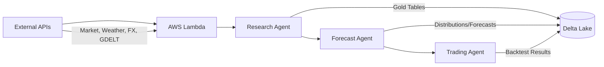

# Overview

Ground Truth is an AI-driven commodity forecasting system designed to help Colombian traders optimize harvest sales through coffee and sugar futures price predictions.

## Mission

Deliver actionable trading recommendations through a three-agent architecture that combines automated data collection, probabilistic machine learning forecasting, and statistical validation.

**Key Insight**: Colombian traders care about `Coffee Price (USD) × COP/USD Exchange Rate`, not just USD futures prices.

## Key Achievements

### 90% Data Reduction
From 75,000 silver layer rows to 7,612 gold layer records while maintaining complete market coverage through forward-fill interpolation and array-based regional data.

### 180x Speedup Evolution
V1 (retrain-per-forecast: 24-48 hours) → V2 (train-once/inference-many: 1-2 hours) → V3 (ml_lib + gold tables: minutes) through architectural improvements and Spark parallelization.

### 70% Accuracy Threshold
Synthetic model testing revealed that 70% directional accuracy is the minimum threshold for prediction-based strategies to outperform baseline approaches.

### 93% Compute Savings
"Fit many, publish few" strategy: Test 200+ configurations in testing schema, select top ~15 diverse models, backfill only selected models (4,800 hours → 360 hours).

## System Architecture

## Three-Agent Architecture

### [Research Agent](/docs/research-agent/introduction)
**Data collection and ETL pipeline**
- 11 AWS Lambda functions (5 data fetchers + 6 GDELT pipeline)
  - Data fetchers: market, weather, VIX, FX, CFTC
  - GDELT pipeline: discovery, bronze transform, csv-bronze-direct, silver backfill, silver discovery, silver transform
- EventBridge daily triggers (2AM UTC)
- Bronze → Gold medallion architecture on Databricks
- 61 weather regions (25 Coffee + 20 Sugar Cane + 16 Sugar Beet)
- 40 FX currency pairs (15 FRED + 25 World Bank)
- [📂 View Code on GitHub →](https://github.com/gibbonstony/ucberkeley-capstone/tree/main/research_agent)

### [Forecast Agent](/docs/forecast-agent/introduction)
**Machine learning forecasting engine**
- ml_lib PySpark framework with gold table integration
- Models: Naive, Linear Regression (Simple, Ridge, LASSO, ElasticNet)
- Transformers: Imputation (4 strategies), Weather (3 aggregation types), GDELT (2 aggregation types)
- Cross-validation: Walk-forward time-series CV with directional accuracy metric
- 14-day forecasts with 2,000 Monte Carlo paths (simulation framework)
- [📂 View Code on GitHub →](https://github.com/gibbonstony/ucberkeley-capstone/tree/main/forecast_agent)

### [Trading Agent](/docs/trading-agent/introduction)
**Strategy optimization and execution**
- 10 trading strategies (4 baseline + 5 prediction-based + 1 MPC)
  - Baseline: ImmediateSale, EqualBatch, PriceThreshold, MovingAverage
  - Predictive: PriceThresholdPredictive, MovingAveragePredictive, ExpectedValue, Consensus, RiskAdjusted
  - Optimization: RollingHorizonMPC (linear programming)
- Multi-model backtesting framework (2,172 lines of runner code)
- WhatsApp integration for daily recommendations
- Multi-currency support (15+ currencies including COP)
- [📂 View Code on GitHub →](https://github.com/gibbonstony/ucberkeley-capstone/tree/main/trading_agent)

## Technology Stack

| Layer | Technologies |
|:------|:------------|
| **Data Platform** | Databricks, Delta Lake, Unity Catalog, PySpark |
| **Cloud Infrastructure** | AWS Lambda, S3, EventBridge |
| **ML Frameworks** | PySpark ML (LinearRegression), scikit-learn patterns |
| **Analysis** | NumPy, Pandas, SciPy |
| **Deployment** | Python 3.11+, Git, Databricks Workflows |

## Quick Start

### For Researchers
Start with the [Research Agent documentation](/docs/research-agent/introduction) to understand our data architecture and ETL pipeline.

### For Data Scientists
Explore the [Forecast Agent documentation](/docs/forecast-agent/introduction) for ML model implementations and Spark parallelization strategies.

### For Traders
Review the [Trading Agent documentation](/docs/trading-agent/introduction) for trading strategies and optimization approaches.

## Resources

- **Live System**: [studiomios.wixstudio.com/caramanta](https://studiomios.wixstudio.com/caramanta)
- **GitHub Repository**: [github.com/gibbonstony/ucberkeley-capstone](https://github.com/gibbonstony/ucberkeley-capstone)
- **UC Berkeley MIDS**: [ischool.berkeley.edu](https://www.ischool.berkeley.edu/programs/mids)
