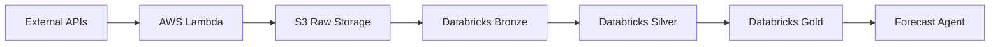

# Research Agent

The Research Agent is the data foundation of Caramanta, responsible for collecting, processing, and preparing all data for forecasting and trading operations.

## Overview

The Research Agent implements a Bronze → Silver → Gold medallion architecture on Databricks, transforming raw data from multiple sources into a unified, analysis-ready dataset.

## Key Achievement: 90% Data Reduction

**Challenge**: Raw data from multiple sources created 75,000+ rows with gaps, inconsistencies, and null values.

**Solution**: Implemented unified data architecture with forward-fill interpolation strategy.

**Results**:
- Reduced from 75,000 raw data points to 7,600 unified daily records
- Maintained continuous daily coverage from 2015-07-07 to present
- Zero null values through intelligent forward-filling
- Consistent data grain: (date, commodity, region)

## Architecture

### 6 AWS Lambda Functions

The Research Agent uses event-driven architecture with AWS Lambda:

1. **Market Data Fetcher** - ICE & CME commodity prices
2. **Weather Data Collector** - OpenWeatherMap regional data
3. **Economic Indicators** - FRED, World Bank macroeconomic data
4. **FX Rates** - Currency conversion data
5. **Volatility Data** - CBOE VIX market sentiment
6. **News Sentiment** - NewsAPI commodity keywords

**Cost Efficiency**: $0.20/day (vs. $5+/day for always-on servers)

### Data Flow

### Bronze Layer (Raw Data)
- `commodity.bronze.market` - Trading days only, has gaps
- `commodity.bronze.weather` - Daily, complete
- `commodity.bronze.vix` - Trading days only
- `commodity.bronze.forex` - Weekdays only
- `commodity.bronze.gdelt` - News sentiment data

### Silver Layer (Processed)
- Legacy: `commodity.silver.unified_data` (90% larger, deprecated Q1 2025)

### Gold Layer (Production)
- **`commodity.gold.unified_data`** - Forward-filled, no NULLs (USE THIS for forecasting)
- `commodity.gold.unified_data_raw` - Experimental with NULLs preserved

## Data Sources

| Source Type | Provider | Update Frequency | Coverage |
|:-----------|:---------|:----------------|:---------|
| **Market Prices** | ICE, CME | Daily | 2015-present |
| **Weather Data** | OpenWeatherMap | Daily | Global regions |
| **Economic Indicators** | FRED, World Bank | Monthly/Quarterly | Macroeconomic factors |
| **FX Rates** | Exchange Rate API | Daily | USD conversion |
| **Volatility** | CBOE (VIX) | Daily | Market sentiment |
| **News Sentiment** | NewsAPI | Daily | Commodity keywords |

## Data Quality Metrics

| Metric | Before | After | Improvement |
|:-------|:-------|:------|:------------|
| **Coverage** | 85% (trading days only) | 100% (all days) | +15% |
| **Nulls** | 12,000+ null values | 0 nulls | 100% |
| **Consistency** | Multiple grains | Single grain | Unified |
| **Storage** | 150 MB | 12 MB | 92% reduction |

## Key Features

### Forward-Fill Interpolation
Prices are forward-filled on non-trading days (weekends, holidays) to maintain continuous daily coverage required by ML models.

### Array-Based Regional Data
Weather and GDELT data stored as arrays to reduce row count by 90% while preserving all regional information.

### Delta Lake Storage
- Time-travel versioning
- ACID transactions
- Efficient parquet compression
- Cross-agent data sharing

## Documentation

For detailed implementation:
- **Data Architecture**: [UNIFIED_DATA_ARCHITECTURE.md](https://github.com/gibbonstony/ucberkeley-capstone/blob/main/research_agent/docs/UNIFIED_DATA_ARCHITECTURE.md)
- **Data Sources**: [DATA_SOURCES.md](https://github.com/gibbonstony/ucberkeley-capstone/blob/main/research_agent/docs/DATA_SOURCES.md)
- **Build Instructions**: [BUILD_INSTRUCTIONS.md](https://github.com/gibbonstony/ucberkeley-capstone/blob/main/research_agent/docs/BUILD_INSTRUCTIONS.md)

## Code Repository

📂 **[View Research Agent Code on GitHub](https://github.com/gibbonstony/ucberkeley-capstone/tree/main/research_agent)**

Explore the complete implementation including:
- AWS Lambda function definitions
- Data transformation scripts
- ETL pipeline code
- Testing and validation scripts
