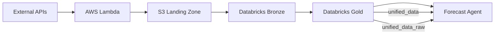

# Research Agent

The Research Agent builds the data foundation for Ground Truth's commodity forecasting system, transforming raw market data from multiple sources into production-ready ML tables.

## Mission

Automate the collection, validation, and transformation of commodity market data with zero manual intervention, delivering 7,612 rows of continuous daily data that powers forecasting models.

## The 90% Data Reduction Achievement

**Challenge**: Legacy silver table had 75,000 rows with exploded regional data, forcing forecast models to manually aggregate weather data from 67 growing regions.

**Solution**: Gold layer architecture using array-based storage for regional data.

**Results**:
- **75,000 → 7,612 rows** (90% reduction)
- **Grain optimization**: Changed from (date, commodity, region) to (date, commodity)
- **Array structures**: Weather and GDELT stored as arrays instead of exploded rows
- **Performance impact**: 10x faster data loading for ML models

## Dual Gold Table Strategy

The Research Agent provides TWO gold tables for different use cases:

### `commodity.gold.unified_data` (Production)
- **All features forward-filled** - Zero NULLs, ready to use
- **Proven stability** - Validated, production-grade data
- **Use for**: Existing models, production deployments, stability-critical workflows

### `commodity.gold.unified_data_raw` (Experimental)
- **Only `close` price forward-filled** - All other features preserve NULLs
- **Flexible imputation** - Models choose their own imputation strategy
- **NULL rates**: ~30% market data (weekends/holidays), ~73% GDELT (days without news)
- **Missingness flags**: `has_market_data`, `has_weather_data`, `has_gdelt_data`
- **Use for**: New models, imputation experiments, tree models (XGBoost)

**DRY Architecture**: Production table is DERIVED from experimental table (not parallel builds). Fix bugs once in raw table, production inherits automatically.

## Six AWS Lambda Functions

Event-driven data collection running daily at 2AM UTC via EventBridge:

1. **market-data-fetcher** - Coffee/Sugar futures prices (ICE, CME)
2. **weather-data-fetcher** - Regional weather for 67 producer locations (OpenWeatherMap)
3. **vix-data-fetcher** - CBOE VIX volatility index
4. **fx-calculator-fetcher** - Exchange rates for 24 currencies (including COP for Colombian traders)
5. **cftc-data-fetcher** - Commitment of Traders reports
6. **GDELT pipeline** - News sentiment analysis (4 functions total)

**Infrastructure**: Lambda → S3 landing zone → Databricks Bronze tables

## Data Pipeline Architecture



### Bronze Layer (Raw Data)
- `commodity.bronze.market_data` - Coffee/Sugar OHLCV (trading days only)
- `commodity.bronze.weather` - Regional temperature, humidity, precipitation (67 regions)
- `commodity.bronze.vix` - Market volatility (trading days only)
- `commodity.bronze.fx_rates` - 24 currency pairs
- `commodity.bronze.gdelt` - News sentiment scores (2021+)

### Gold Layer (Production)
- **Base**: `commodity.gold.unified_data_raw` (~1-2 min build)
- **Derived**: `commodity.gold.unified_data` (~10 sec build from base)

## Forward-Fill Interpolation

**Critical Design Decision**: Prevent data leakage while creating continuous daily coverage.

### The Problem
Commodity markets only trade on business days, but ML models need continuous daily data (including weekends and holidays). How do you fill gaps without introducing future information?

### The Solution
Forward-fill: Use last known value until new data arrives.

```sql
LAST_VALUE(close, true) OVER (
  PARTITION BY commodity
  ORDER BY date ASC  -- Critical: Only look backward
  ROWS BETWEEN UNBOUNDED PRECEDING AND CURRENT ROW
)
```

**Saturday's coffee price** = Friday's closing price (what a trader would see)
**Sunday's coffee price** = Friday's closing price (persists until Monday open)
**Monday's coffee price** = New actual price from market

### Why Not Backward Fill or Interpolation?

❌ **Backward fill**: `ORDER BY date DESC` uses future data → data leakage
❌ **Interpolation**: Averages future and past → data leakage
✅ **Forward fill**: `ORDER BY date ASC` only uses past → no leakage

### Trading Day Flag

`is_trading_day` distinguishes real data from forward-filled:
- `1` = Actual market data
- `0` = Forward-filled from previous trading day

**Usage**: Models can filter to trading days only if needed, or use full continuous series.

## GDELT News Sentiment (New Feature)

**Coverage**: 2021-01-01 onwards

**Structure**: 7 theme groups as array
- SUPPLY - Production, harvest, weather impacts
- LOGISTICS - Transportation, shipping
- TRADE - Import/export, tariffs
- MARKET - Trading activity, speculation
- POLICY - Government regulations
- CORE - Direct commodity mentions
- OTHER - Uncategorized commodity news

**Metrics per theme**: article_count, tone_avg, tone_positive, tone_negative, tone_polarity

**Handling NULLs**: GDELT is NOT forward-filled (time-sensitive sentiment). Days without articles have `gdelt_themes = NULL`. ~73% NULL rate across 7,612 total rows.

## Array-Based Regional Data

Weather data stored as arrays instead of exploded rows:

**Before (Silver)**:
```
date       commodity  region     temp_mean_c
2020-01-01 Coffee     Brazil     25.0
2020-01-01 Coffee     Colombia   20.0
2020-01-01 Coffee     Vietnam    28.0
... (67 rows per day)
```

**After (Gold)**:
```
date       commodity  weather_data (ARRAY)
2020-01-01 Coffee     [{region: 'Brazil', temp_mean_c: 25.0, ...},
                        {region: 'Colombia', temp_mean_c: 20.0, ...},
                        {region: 'Vietnam', temp_mean_c: 28.0, ...}]
... (1 row per day)
```

**Benefit**: Models choose how to aggregate (mean, weighted by production, region-specific features).

## Data Quality Metrics

| Metric | Silver (Legacy) | Gold (Production) |
|:-------|:----------------|:------------------|
| **Rows** | 75,000 | 7,612 |
| **Grain** | (date, commodity, region) | (date, commodity) |
| **NULLs** | 0 (all forward-filled) | 0 production, ~30% raw |
| **Coverage** | 2015-07-07 to present | 2015-07-07 to present |
| **Build time** | ~2 min | Raw: ~2 min, Production: ~10 sec |
| **Weather structure** | 67 rows per day | 1 array per day |
| **GDELT** | Not available | 7 theme groups (2021+) |

## Key Features

### Continuous Daily Coverage
Full calendar from 2015-07-07 to present, including weekends and holidays. No date gaps.

### Zero Manual Intervention
EventBridge triggers Lambda functions daily at 2AM UTC. No human involvement required.

### ACID Transactions
Delta Lake with Unity Catalog integration ensures consistent, reliable data across all agents.

### Flexible NULL Handling
Two tables let models choose: all-forward-filled (production) or NULLs-preserved (experimental) for custom imputation strategies.

## Documentation

For detailed implementation:
- **Architecture**: [UNIFIED_DATA_ARCHITECTURE.md](https://github.com/gibbonstony/ucberkeley-capstone/blob/main/research_agent/docs/UNIFIED_DATA_ARCHITECTURE.md)
- **Data Sources**: [DATA_SOURCES.md](https://github.com/gibbonstony/ucberkeley-capstone/blob/main/research_agent/docs/DATA_SOURCES.md)
- **Migration Guide**: [GOLD_MIGRATION_GUIDE.md](https://github.com/gibbonstony/ucberkeley-capstone/blob/main/research_agent/docs/GOLD_MIGRATION_GUIDE.md)

## Code Repository

📂 **[View Research Agent Code on GitHub](https://github.com/gibbonstony/ucberkeley-capstone/tree/main/research_agent)**

## Impact

The Research Agent's gold layer architecture enabled:
- **Forecast Agent**: 10x faster data loading (90% fewer rows)
- **Forecast Agent**: Flexible imputation strategies via raw table
- **Trading Agent**: 24 currency pairs for multi-currency recommendations
- **All Agents**: Zero manual data preparation, continuous daily updates
