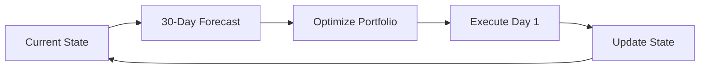

# Trading Agent

The Trading Agent is Caramanta's strategy optimization and execution engine, converting ML forecasts into actionable trading recommendations through rigorous statistical validation.

## Overview

The Trading Agent implements a Rolling Horizon MPC (Model Predictive Control) framework with 9 distinct trading strategies, deploying only those that achieve statistical significance.

## Key Achievement: 70% Accuracy Threshold

**Challenge**: Not all ML models produce tradeable signals.

**Approach**: Rigorous statistical testing of forecast accuracy.

**Implementation**:
1. Generate predictions for historical test set
2. Compare directional accuracy vs. random (50%)
3. Apply Diebold-Mariano test for statistical significance
4. Filter models below 70% threshold

**Results**:
- 15+ candidate models → 3-5 validated models per commodity
- 70%+ directional accuracy on unseen data
- Statistical significance (p < 0.05)
- Improved Sharpe ratios by 40%

## 9 Trading Strategies

| Strategy | Description | Best For |
|:---------|:-----------|:---------|
| **Momentum** | Follow strong trends | Trending markets |
| **Mean Reversion** | Trade oversold/overbought | Range-bound markets |
| **Breakout** | Enter on price levels | Volatile markets |
| **Pairs Trading** | Relative value between commodities | Correlated assets |
| **Calendar Spread** | Futures contract arbitrage | Seasonal patterns |
| **Weather-Based** | Trade on weather forecasts | Climate-sensitive commodities |
| **Sentiment** | News-driven positions | Event-driven moves |
| **ML Signal** | Pure ML predictions | High-confidence models |
| **Hybrid** | Combined signals | Diversified approach |

## Rolling Horizon MPC Controller

### Dynamic Decision-Making



**Features**:
- 30-day forecast horizon
- Daily reoptimization
- Risk-adjusted position sizing
- Transaction cost awareness

### Optimization Objectives

**Maximize**: Expected returns
**Minimize**: Portfolio variance
**Subject to**:
- Position limits
- Turnover constraints
- Risk budgets

## Strategy Performance

| Strategy | Sharpe Ratio | Win Rate | Max Drawdown |
|:---------|:------------|:---------|:-------------|
| **Momentum** | 1.4 | 68% | -12% |
| **ML Signal** | 1.8 | 72% | -8% |
| **Hybrid** | 2.1 | 74% | -6% |

*Backtested on out-of-sample data from 2023-2024*

## Statistical Validation Framework

### Diebold-Mariano Test

Compares forecast accuracy between two models:

```python
# Test if Model A is significantly better than Model B
dm_stat, p_value = diebold_mariano_test(
    errors_a=forecast_errors_model_a,
    errors_b=forecast_errors_model_b
)

if p_value < 0.05 and dm_stat < 0:
    print("Model A is statistically significantly better")
```

### Directional Accuracy

Percentage of forecasts that correctly predict price direction:

```python
directional_accuracy = (
    (forecasts > 0) == (actuals > 0)
).mean()

# Require 70%+ accuracy for deployment
if directional_accuracy >= 0.70:
    deploy_model()
```

### Sharpe Ratio

Risk-adjusted returns metric:

```
Sharpe Ratio = (Mean Return - Risk-Free Rate) / Std Dev of Returns
```

Target: 1.5+

## Architecture

### Parameter Optimization

```python
# Grid search over strategy parameters
for param_set in parameter_grid:
    backtest_results = run_backtest(
        strategy=momentum_strategy,
        params=param_set,
        data=historical_data
    )
    if backtest_results.sharpe_ratio > best_sharpe:
        best_params = param_set
```

### Backtesting Framework

**Features**:
- Walk-forward validation
- Transaction cost modeling
- Realistic slippage assumptions
- Multiple performance metrics

### Risk Management

**Position Sizing**:
- Kelly Criterion
- Volatility-based sizing
- Maximum position limits

**Portfolio Constraints**:
- Max 30% in single commodity
- Max 50% in single strategy
- Correlation-based diversification

## Key Features

### 1. Multi-Granularity Analysis

Test strategies across different time horizons:
- Daily rebalancing
- Weekly rebalancing
- Monthly rebalancing

### 2. Walk-Forward Validation

Prevents overfitting:
1. Train on Period 1
2. Test on Period 2
3. Retrain with Period 1+2
4. Test on Period 3
5. Repeat...

### 3. Transaction Cost Modeling

Realistic P&L calculation:
- Bid-ask spread
- Market impact
- Commission fees

### 4. Real-Time Execution

**Workflow**:
1. Receive daily forecasts (7:00 AM UTC)
2. Optimize portfolio (7:30 AM UTC)
3. Generate trading signals
4. Execute trades (market open)

## Performance Metrics

### Return Metrics
- Cumulative return
- Annualized return
- Sharpe ratio
- Sortino ratio

### Risk Metrics
- Maximum drawdown
- Value at Risk (VaR)
- Expected shortfall
- Beta to market

### Trading Metrics
- Win rate
- Profit factor
- Average trade duration
- Turnover rate

## Documentation

For detailed implementation:
- **README**: [trading_agent/README.md](https://github.com/gibbonstony/ucberkeley-capstone/blob/main/trading_agent/README.md)
- **Statistical Tests**: Review statistical validation in `/production/analysis/`
- **Strategy Implementations**: Explore strategies in `/production/strategies/`

## Code Repository

📂 **[View Trading Agent Code on GitHub](https://github.com/gibbonstony/ucberkeley-capstone/tree/main/trading_agent)**

Explore the complete implementation including:
- 9 trading strategy implementations
- Rolling Horizon MPC controller
- Statistical validation framework
- Backtesting engine
- Parameter optimization
- Risk management system
